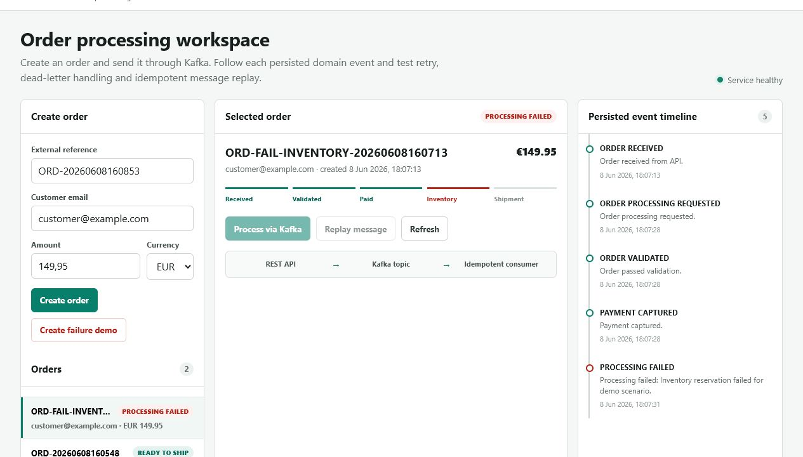
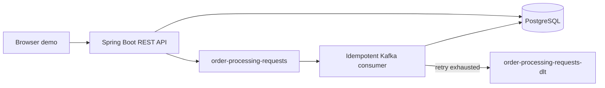

# OrderFlow Events

[](https://github.com/itqaanconsulting/orderflow-events/actions/workflows/ci.yml)

Event-driven order processing showcase built with Java 21, Spring Boot, Apache Kafka and PostgreSQL.

The REST API accepts orders and publishes processing requests to Kafka. An idempotent consumer executes the order lifecycle, persists every domain event and sends messages that keep failing to a dead-letter topic.



## Highlights

- Asynchronous order processing with Apache Kafka
- Explicit order lifecycle and persisted event timeline
- Idempotent message handling based on a unique message ID
- Configurable retry handling and dead-letter topic recovery
- PostgreSQL persistence and versioned Flyway migrations
- REST validation, business rules and consistent API errors
- Interactive browser demo and OpenAPI documentation
- Fast H2 integration tests and real Kafka tests with Testcontainers
- GitHub Actions CI on Java 21

## Architecture



The API responds with `202 Accepted` and a message ID when processing is requested. Kafka decouples the request from the lifecycle execution. The consumer checks the `processed_messages` table before handling a message, preventing duplicate lifecycle events when Kafka redelivers a record.

## Run Locally

Requirements:

- Java 21
- Maven 3.9+
- Docker Desktop

Start PostgreSQL and Kafka:

```powershell
docker compose up -d
```

Start the application:

```powershell
mvn spring-boot:run
```

Open:

- Demo: [http://localhost:8082](http://localhost:8082)
- Swagger UI: [http://localhost:8082/swagger-ui.html](http://localhost:8082/swagger-ui.html)
- Health: [http://localhost:8082/actuator/health](http://localhost:8082/actuator/health)

PostgreSQL is exposed on `localhost:5433` and Kafka on `localhost:9092`.

## Five-Minute Demo

1. Click **Create order** and select the new order.
2. Click **Process via Kafka**.
3. Show that the API returns immediately while the order progresses asynchronously to `READY_TO_SHIP`.
4. Walk through the persisted event timeline.
5. Click **Replay message** and show that the event count does not increase.
6. Click **Create failure demo**, then **Process via Kafka**.
7. Show the retries, `PROCESSING_FAILED` status and dead-letter result.

The demo covers the successful flow, observability through domain events, idempotency and failure recovery without requiring manual API calls.

## Processing Flows

### Successful processing

```text
RECEIVED
  -> VALIDATED
  -> PAID
  -> INVENTORY_RESERVED
  -> READY_TO_SHIP
```

### Failed processing

An order reference containing `FAIL-INVENTORY` triggers the demo failure. The consumer performs the initial attempt plus two retries. It then:

1. Sets the order status to `PROCESSING_FAILED`.
2. Persists a `PROCESSING_FAILED` domain event.
3. Publishes the original message to `order-processing-requests-dlt`.

Inspect the dead-letter topic:

```powershell
docker exec orderflow-kafka /opt/kafka/bin/kafka-console-consumer.sh `
  --bootstrap-server localhost:9092 `
  --topic order-processing-requests-dlt `
  --from-beginning
```

## API

```http
POST /api/orders
GET  /api/orders
GET  /api/orders/{id}
POST /api/orders/{id}/validate
POST /api/orders/{id}/mark-paid
POST /api/orders/{id}/reserve-inventory
POST /api/orders/{id}/prepare-shipment
POST /api/orders/{id}/process
POST /api/orders/{id}/process/{messageId}/replay
GET  /api/orders/{id}/events
GET  /api/orders/processed-messages
```

## Package Structure

```text
order.api          REST controllers and DTOs
order.application  use cases and workflow services
order.domain       entities, statuses and domain exceptions
order.messaging    Kafka configuration, producers and consumers
order.persistence  Spring Data repositories
shared             shared API error handling
```

## Tests

Run the fast integration suite without Docker:

```powershell
mvn test
```

Run the complete suite with a real Kafka broker managed by Testcontainers:

```powershell
mvn -Pkafka-it verify
```

The complete suite verifies:

- Order creation and lifecycle business rules
- Asynchronous processing
- Duplicate-message protection
- Failure status and event persistence
- Delivery to the real Kafka dead-letter topic
- Availability of the interactive demo

## Scope

This repository is intentionally focused on event-driven processing rather than a complete commerce platform. Authentication, product management, payment-provider integration and deployment infrastructure are outside the current scope.
